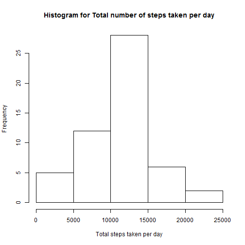
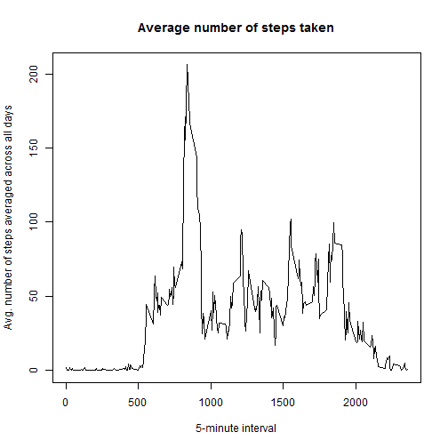
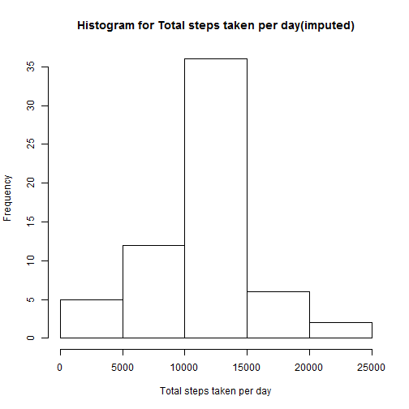
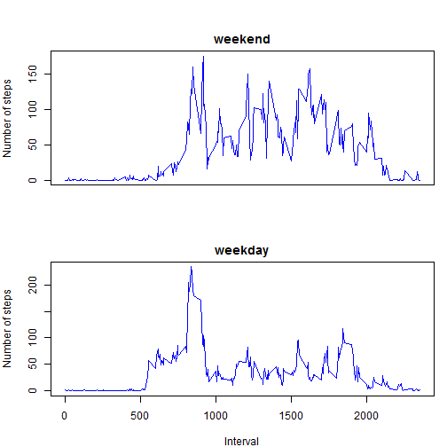

## Loading and preprocessing the data
Load the activity data through csv.


```r
activity<-read.csv("activity.csv")
activity$date<-as.Date(activity$date)
```

## Mean total number of steps taken per day:
We calculate the mean total number of steps taken per day, ignoring any missing values if present in the activity data. We show the distribution of total steps taken per day by plotting a histogram.


```r
total_stepsbydate<-aggregate(steps~date,data=activity,sum)
hist(total_stepsbydate$steps,main="Histogram for Total number of steps taken per day",xlab="Total steps taken per day")
```

 

```r
mean_stepsbydate<-mean(total_stepsbydate$steps)
median_stepsbydate<-median(total_stepsbydate$steps)
```
**The mean total number of steps taken per day is 1.0766189 &times; 10<sup>4</sup>.  The median of total number of steps taken per day is 10765.**

## Average daily activity pattern
We calculate the average number of steps taken, averaged across all days for each 5-minute interval. We then report the 5-minute interval which has the maximum average number of steps.


```r
avg_stepsbyinterval<-aggregate(steps~interval,data=activity,mean)
plot(steps~interval,data=avg_stepsbyinterval,type="l",main="Average number of steps taken",xlab="5-minute interval",ylab="Avg. number of steps averaged across all days")
```

 

```r
interval_maxsteps<-avg_stepsbyinterval$interval[which(avg_stepsbyinterval$steps==max(avg_stepsbyinterval$steps))]
```

**Maximum number of steps averaged across all days were taken in the 5-minute interval starting at 835.**

## Imputing missing values

```r
incomplete_cases<-dim(activity[!complete.cases(activity),])[1]
```
There are total **2304** missing values in the activity data set. We now fill this missing values with the mean for that 5-minute interval.


```r
complete_activity<-activity

for(row in which(is.na(complete_activity$steps))) {
  complete_activity$steps[row]<-as.numeric(avg_stepsbyinterval[avg_stepsbyinterval$interval == complete_activity$interval[row],]["steps"])
}
```

We now analyse the total number of steps taken each day and calculate the mean median total number of steps taken per day to find out the impact of imputing missing data on the estimates of the total daily number of steps.


```r
complete_stepsbydate<-aggregate(steps~date,data=complete_activity,sum)
hist(complete_stepsbydate$steps,main="Histogram for Total steps taken per day(imputed)",xlab="Total steps taken per day")
```

 

```r
mean_completesteps<-mean(complete_stepsbydate$steps)
median_completesteps<-median(complete_stepsbydate$steps)
```

The **mean** total number of steps taken per day was found to be **1.0766189 &times; 10<sup>4</sup>** and **median** total number of steps taken per day **1.0766189 &times; 10<sup>4</sup>** after imputing missing values with the mean for that 5-minute interval.  After imputing, the mean total number of steps remains unchanged whereas median changed and is now equal to the mean total number of steps. The overall impact of imputing missing value is having less variance in the dataset.

## Differences in activity patterns between weekdays and weekends


```r
which_day<-function(day){
  if(day=="Saturday" | day=="Sunday"){
    return("weekend")
  }
  else{
    return("weekday")
  }
}
day<-sapply(weekdays(activity$date),FUN=which_day)

activity$day<-factor(day)

weekday_stepbyinterval<-aggregate(steps~interval,data=activity[activity$day=="weekday",],mean)
weekend_stepbyinterval<-aggregate(steps~interval,data=activity[activity$day=="weekend",],mean)

par(mfrow=c(2,1),mar=c(4,4,2,1),oma=c(0,0,2,0))
plot(steps~interval,data=weekend_stepbyinterval,type="l",main="weekend",xlab="",ylab="Number of steps",col="blue",xaxt="n")
plot(steps~interval,data=weekday_stepbyinterval,type="l",main="weekday",xlab="Interval",ylab="Number of steps",col="blue")
```

 

The dataset describes that the average number of steps on weekends is much more uniformly distributed throughout the day than on weekdays. This might be due to the reason that the user performs routines on weekdays which requires more or less activity in an interval.
